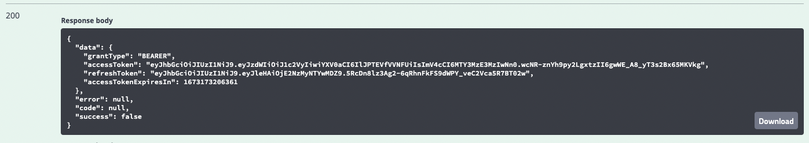
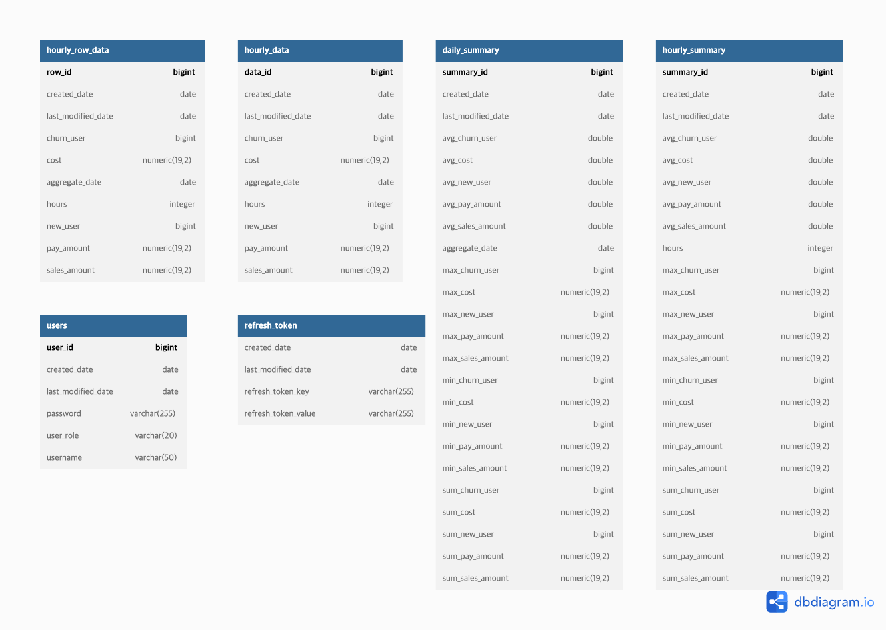
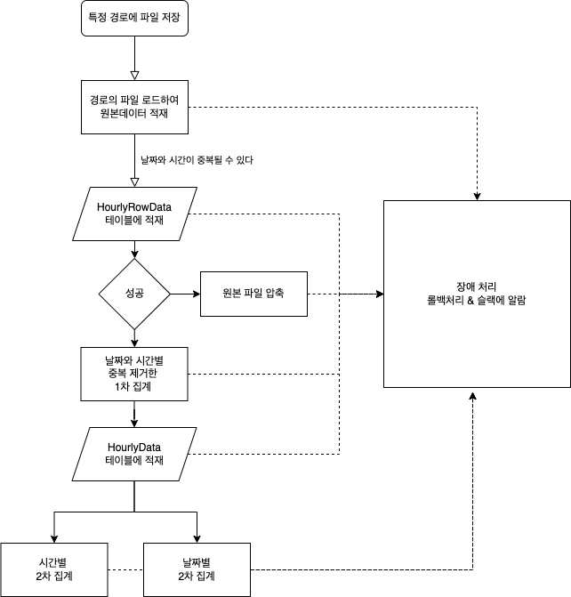

# test_scheduler_api

### 버전

- JDK 11
- H2 2.1.214
- Spring Boot 2.7.6
- Junit 5

---
### 설정 사항 

- 기본적으로 API와 Batch 모두 default profile에서 동작하도록 되어 있습니다.
  

- Batch는 ```src/main/resource/data``` 하위에 있는 파일들을 읽어서 작업을 수행합니다.
  

- 현재 기본적으로 ```.txt(/) .text(|) .csv(.)```의 파일들을 괄호안에 명시된 구분자로 구분하여 동작하며 
파일 형식과 구분자는 FileType Enum에 명시되어 있습니다.
  

- 기본 H2 Database는 ```DB이름: Test  Username:sa  password:1234```에서 동작합니다. 
  

- Swagger를 이용하여 테스트를 하실때 먼저 로그인을 수행하여 토을 발급받아야합니다.
  1. 먼저 로그인 ( ID: user , PW: user1234 )을 합니다.
  
  2. 위와 같은 로그인 결과에서 access_token 값을 복사하여
  Bearer ${access_token}에서 access_token에 붙여넣습니다.
  3. 해당 문자열을 아래 인증 버튼을 눌러서 인증을 수행합니다. 
  
 
---
### 테이블 설계

---
### 배치 흐름도 



